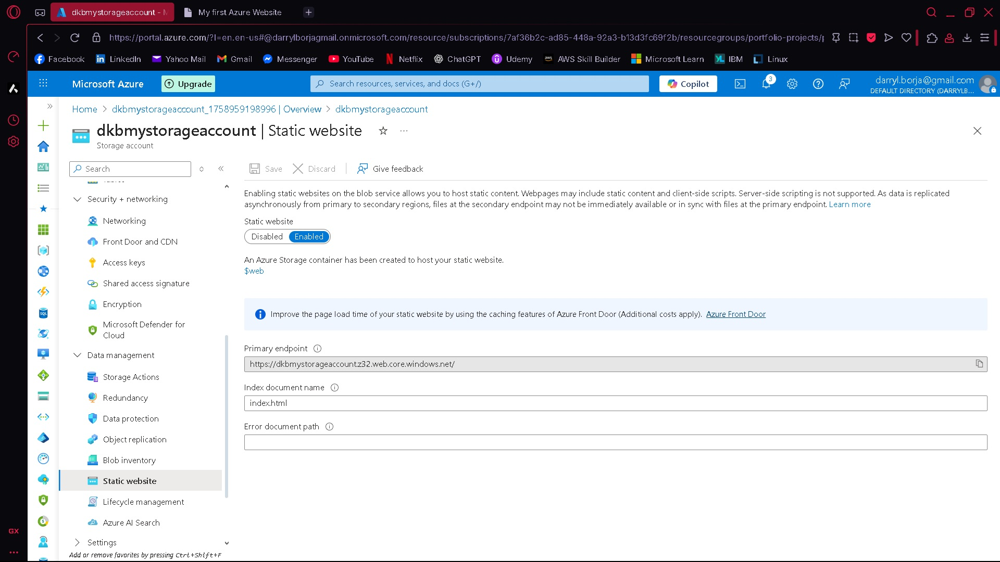
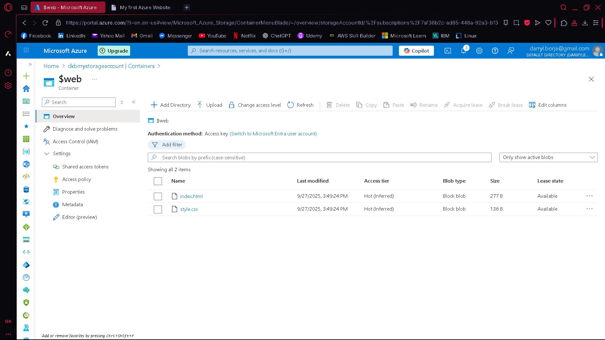
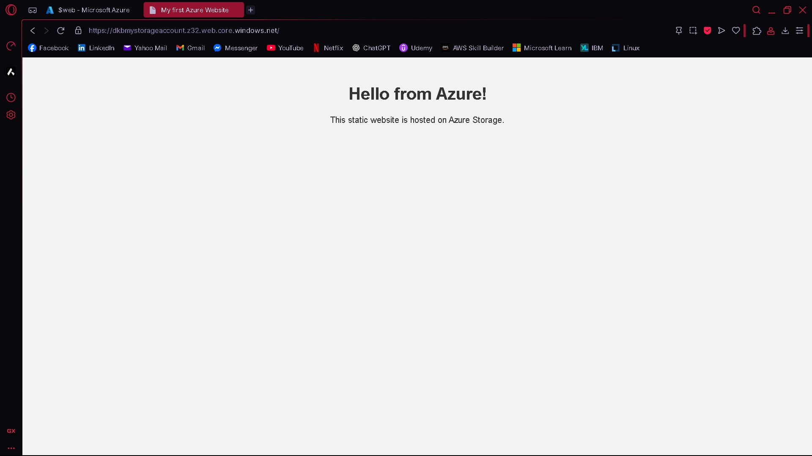

# azure-static-website

# Azure Static Website Hosting

This project demonstrates how to host a static HTML website using an Azure Storage Account with static website hosting enabled.

## ✅ Azure Services Used

- Azure Storage Account
- Static Website feature
- Blob Container `$web`

## 📷 Screenshots

## 🧠 What I Learned

- Creating and configuring an Azure Storage Account
- Enabling static site hosting in Azure
- Uploading files via Blob container
